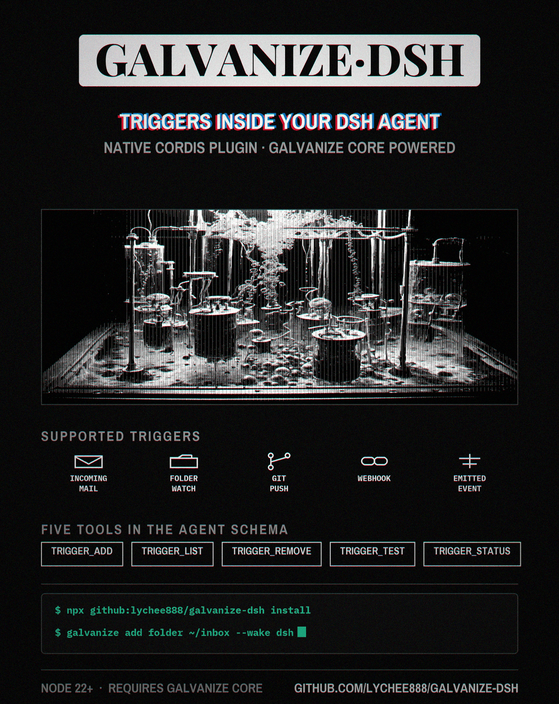

**Give your DeepSeek Harness agent a way to wake itself up.** Once this
bundle is installed, your DSH agent registers event triggers by itself: a
file landing in a folder, an email arriving, a webhook firing, a git push.
When one happens, the galvanize core spawns a **fresh headless DSH session**
with your prompt and the event's data — so "wake me when a resume shows up
in my downloads" is a real push trigger, not a poll job. The plugin itself is
a thin, verified client: five `trigger_*` tools in the agent schema, every
answer proxied from the core's local API. Installation ends by *proving the
plugin loaded* — live profile probes and authenticated core access — because a
broken DSH plugin fails as a silent no-op, and "should be fine" is the one
answer this installer refuses to give.

## Install

Works on Windows, macOS, and Linux (Node ^22.19 || >=24 — DSH's own range).
No cloning needed; one command runs straight from GitHub:

```bash
npx github:lychee888/galvanize-dsh install
# or global: npm install -g github:lychee888/galvanize-dsh
# from a clone: npm ci && node lib/cli.js install
```

`install` needs two things on the machine first:

```bash
# 1. the galvanize core (same family; daemon + autostart included):
pipx install "git+https://github.com/lychee888/galvanize.git"
galvanize init

# 2. DeepSeek Harness with its CLI on PATH:
npm install -g @deepseek-ai/dsh
```

Then that one `npx github:…` command mounts the bundle into your DSH `web`
profile (`--profile <p>` to change), bootstraps the headless wake profile,
probes both profiles, and reports success only with live plugin proof and
usable core access. Verification of a running profile prints four checks:

```
  ✔ core /version handshake        core 0.2.0, api 1
  ✔ authenticated core access      read-only trigger list succeeded
  ✔ patch row 'galvanize/tools'    row present, package resolvable
  ✔ plugin heartbeat               plugin 0.1.6, core_api_ok=true, 3s ago
LOADED: all four checks green.
```

`galvanize-dsh verify --profile <name>` re-runs those checks while that profile is running;
`galvanize-dsh uninstall` reverses everything.

Use `--wake-profile <name>` to choose a profile other than `headless`. The installer saves that choice into each installed profile's `cordis.patch.yml`, preserving existing settings, so later `trigger_add` calls use the same profile that the install probe verified. Uninstall removes overrides created by the installer and preserves user-authored rows.

Use the same `--profile` and `--wake-profile` options when uninstalling a custom installation.

Installation probes both the target and wake profiles with separate random
session tokens. Proof must come from that exact profile and token, the installed
plugin version, a live PID, a compatible core handshake, and authenticated
read-only core access. Missing or invalid credentials fail verification even
when a recent heartbeat looked healthy. Running
another profile cannot make a failed probe pass. Session records live under
`~/.galvanize/dsh-heartbeats/<profile>/`; the legacy `dsh-heartbeat.json` is only
a diagnostic and is never accepted by verification. Stopped, stale, unhealthy,
or old-version sessions do not prove LOADED. Re-run the installer after upgrading
to populate profile identity in existing configurations.

The installer also updates the core's shared `dsh_wake_profile` setting, making
`galvanize add --wake dsh` select the same profile as plugin-created triggers.
Upgrade the core together with this plugin; installation reports an error if
the core cannot persist this setting. This affects newly created triggers only.

## First trigger

```bash
galvanize add folder ~/inbox --name triage --wake dsh \
  --prompt 'Read {file} and write a triage summary to ~/inbox-out/{file}.md'

echo hello > ~/inbox/demo.txt   # a minute later: ~/inbox-out/demo.txt.md
```

Or skip the CLI and just tell your agent in a DSH chat:
*"wake me when a lab report lands in my inbox"* — it calls `trigger_add`
itself, test-fires once so you watch it work, and stays quiet until the
event actually happens.

## What the agent gets

| Tool | What it does |
|---|---|
| `trigger_add` | register a trigger (folder / webhook / emit / imap) — *the event-shaped alternative to a poll job* |
| `trigger_list` | what's watching, with settings |
| `trigger_test` | fire a synthetic event through the real dispatch path |
| `trigger_status` | honest health: daemon, last fire, fires today, last error |
| `trigger_remove` | take one out (route cleanup included) |

```
event ── galvanize core ── wake ──▶ dsh --profile headless "<your prompt>"
 (folder/        (dedupe, cooldown,          │
  mail/webhook/   routes, delivery)          ▼
  git/emit)                          fresh DSH session
```

- **Thin client:** no wake or trigger logic in JS — everything proxies to the
  core's loopback API (`GET /version`, `POST /manage/<op>`, bearer token), so
  behavior matches the core's plugins for Hermes / Claude Code / Codex.
- **Exactly-one-surface:** plugin and `galvanize mcp` never coexist; the
  active one claims `~/.galvanize/surfaces.json` and the core's `doctor`
  flags double-mounts.
- **Wake preset:** the core spawns `dsh --profile <wakeProfile> "<prompt>"`
  per event; the profile, command, and heartbeat cadence are config on the
  bundle row.

## Development

For `kind=webhook` with a DSH or shell wake, `trigger_add` requires `relay_url` and accepts `relay_token` (the worker's `RELAY_TOKEN`). Deploy the galvanize relay with a separate `INGEST_TOKEN` and have senders use `Authorization: Bearer <INGEST_TOKEN>` at the returned `/ingest/<name>` URL. A missing relay returns an error before a trigger is created. See the [core's relay setup](https://github.com/lychee888/galvanize#relay-webhooks).

```bash
npm ci && npm run build && npx vitest run && npx publint
```

`src/index.ts` (tools) · `src/core-client.ts` (serve client) ·
`src/cli.ts` (installer / verify / uninstall) · `test/` (unit and integration tests).
Clone the follow-up galvanize core beside this checkout, or set
`GALVANIZE_CORE_SOURCE` to its path, and install its Python dependencies.
`GALVANIZE_CORE_PYTHON` optionally selects the interpreter. Integration tests
start the real Python core, compare CLI and plugin creation, and boot the
official DSH runtime in an isolated minimal profile with real tool services.
They make no model/provider calls and do not alter the user's DSH installation.
The fixture pins DSH 0.1.1-rc.2 and HMR 1.0.16 because HMR 1.0.19 removed the
`registerConfig` API that this DSH release calls. CI runs all tests on Windows,
Linux, and macOS; provider-backed headless sessions remain a separate live check.

## License

MIT
